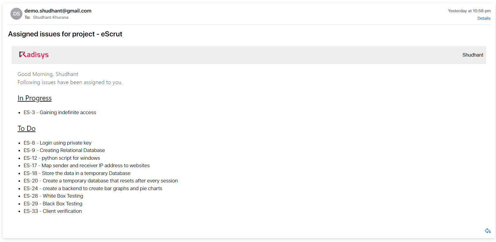

## JIRA Scraping tool

This tool provides a daily update regarding the Open Issues of an organisation's ongoing projects on Atlassian JIRA.

To use this tool one must have the following:-

1. An atlassian account
2. Organisation admin access on that account.
3. An e-mail account (outlook preferred)

Following Files have not been uploaded in this repository :-

1. config.py -- contains API keys of Atlassian Account 
2. mailConfig.py -- contains username and passwords of the email server that will be used to send email.

These files contain sensitive information such as usernames, passwords and email addresses which should be kept private.

Instead a demoConfig directory is provided that contains a format of the above mentioned files

## Working of this tool is described below :-

1. First, all the ongoing projects in an organisation are fetched.
2. Based on found project key, all the stakeholders of the corrosponding projects and their emailIds are retrieved
3. All the issues assigned to a stakeholder and their status is retrieved from the Atlassian JIRA server.
4. This data is now pushed to a Jinja Template
5. The rendered Jinja Template is now sent to each one of the stakeholder.
6. This process is followed till an email is sent to all the stakeholders of each ongoing project in an organisation.

## The email sent looks like this :-

